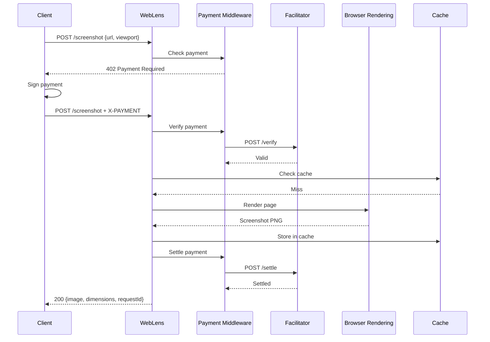
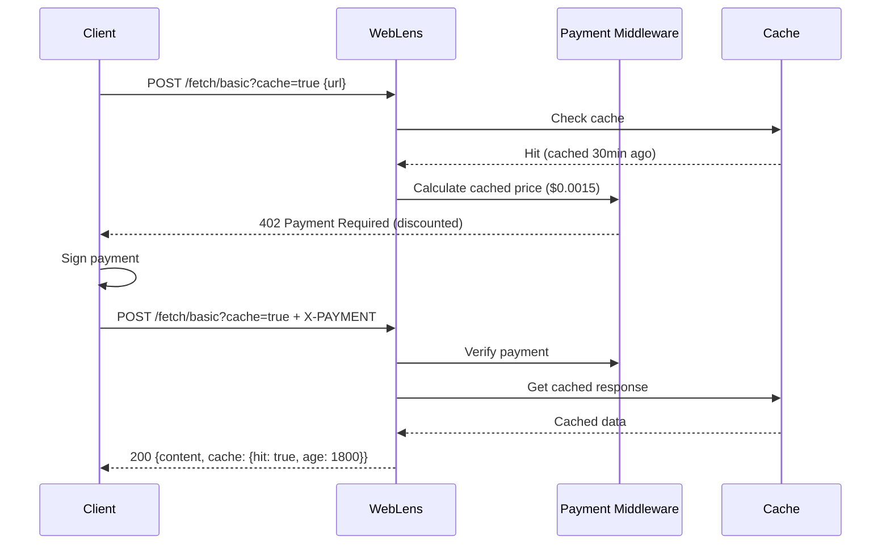

# Design Document: WebLens Phase 1

## Overview

WebLens Phase 1 extends the core web intelligence API with four major enhancements: screenshot capture, tiered pricing, response caching, and multi-chain payment support. The system is built on Cloudflare Workers with Hono framework and integrates with x402 payment protocol for micropayments.

## Business Context

### Target Users
- **AI Agents**: Autonomous systems (Claude, GPT, custom agents) requiring web intelligence
- **MCP Clients**: Model Context Protocol clients needing paid tool access
- **Developers**: Building applications that need web scraping with micropayments

### Revenue Model
| Endpoint | Price | Cached Price | Est. Daily Volume | Daily Revenue |
|----------|-------|--------------|-------------------|---------------|
| `/screenshot` | $0.02 | $0.006 | 500 | $10 |
| `/fetch/basic` | $0.005 | $0.0015 | 2000 | $10 |
| `/fetch/pro` | $0.015 | $0.0045 | 500 | $7.50 |
| `/search` | $0.005 | $0.0015 | 1000 | $5 |
| `/extract` | $0.02 | $0.006 | 200 | $4 |
| **Total** | | | **4200** | **$36.50/day** |

### Competitive Advantages
1. **First x402-native web intelligence API** - Auto-discovered in Bazaar
2. **Multi-chain payments** - Accept Base, Solana, Polygon
3. **Caching with discounts** - 70% off for cached responses
4. **Tiered pricing** - Pay only for what you need
5. **AI-optimized output** - Markdown format, metadata extraction

## Architecture

```mermaid
graph TB
    subgraph "Client Layer"
        AI[AI Agent]
        MCP[MCP Client]
    end
    
    subgraph "Cloudflare Workers"
        HN[Hono Router]
        PM[x402 Payment Middleware]
        
        subgraph "Endpoints"
            SS[/screenshot]
            FB[/fetch/basic]
            FP[/fetch/pro]
            SR[/search]
            EX[/extract]
        end
        
        subgraph "Services"
            BR[Browser Rendering]
            PS[Page Parser]
            CM[Cache Manager]
        end
    end
    
    subgraph "External Services"
        KV[(Cloudflare KV)]
        CDP[CDP Facilitator]
        PAI[PayAI Facilitator]
    end
    
    AI --> HN
    MCP --> HN
    HN --> PM
    PM --> SS & FB & FP & SR & EX
    SS --> BR
    FP --> BR
    FB --> PS
    SS & FB & FP --> CM
    CM --> KV
    PM --> CDP
    PM --> PAI
```

## Components and Interfaces

### 1. Screenshot Service

Captures webpage screenshots using Cloudflare Browser Rendering.

```typescript
interface ScreenshotRequest {
  url: string;
  viewport?: {
    width: number;   // 320-3840, default 1280
    height: number;  // 240-2160, default 720
  };
  selector?: string;      // CSS selector for element capture
  fullPage?: boolean;     // Capture entire scrollable page
  timeout?: number;       // 5000-30000ms, default 10000
}

interface ScreenshotResponse {
  url: string;
  image: string;          // Base64-encoded PNG
  dimensions: {
    width: number;
    height: number;
  };
  capturedAt: string;     // ISO timestamp
  requestId: string;
}
```

### 2. Tiered Fetch Service

Provides basic (no JS) and pro (with JS rendering) fetch options.

```typescript
interface FetchRequest {
  url: string;
  timeout?: number;
  cache?: boolean;
  cacheTtl?: number;
}

interface FetchResponse {
  url: string;
  title: string;
  content: string;        // Markdown
  metadata: PageMetadata;
  tier: "basic" | "pro";
  fetchedAt: string;
  cache?: CacheMetadata;
  requestId: string;
}

interface PageMetadata {
  description?: string;
  author?: string;
  publishedAt?: string;
}
```

### 3. Cache Manager

Manages response caching using Cloudflare KV.

```typescript
interface CacheManager {
  get(key: string): Promise<CachedResponse | null>;
  set(key: string, value: CachedResponse, ttl: number): Promise<void>;
  generateKey(endpoint: string, params: object): string;
}

interface CachedResponse {
  data: unknown;
  cachedAt: string;
  ttl: number;
}

interface CacheMetadata {
  hit: boolean;
  age?: number;           // Seconds since cached
  expiresAt?: string;     // ISO timestamp
  key?: string;
}
```

### 4. Multi-Chain Payment Handler

Routes payments to appropriate facilitators based on network.

```typescript
interface PaymentConfig {
  walletAddress: Address;
  networks: NetworkConfig[];
}

interface NetworkConfig {
  network: "base" | "base-sepolia" | "solana" | "polygon";
  facilitator: "cdp" | "payai";
  facilitatorUrl: string;
}

const FACILITATORS = {
  cdp: "https://x402.org/facilitator",
  payai: "https://facilitator.payai.network"
};
```

### 5. Pricing Configuration

```typescript
const PRICING = {
  screenshot: "$0.02",
  fetch: {
    basic: "$0.005",
    pro: "$0.015"
  },
  search: "$0.005",
  extract: "$0.02",
  cacheDiscount: 0.7  // 70% off for cached responses
};

// Calculate cached price
function getCachedPrice(basePrice: string): string {
  const amount = parseFloat(basePrice.replace("$", ""));
  const cachedAmount = amount * (1 - PRICING.cacheDiscount);
  return `$${cachedAmount.toFixed(4)}`;
}
```

### 6. Request ID Generator

```typescript
// Generates unique request IDs for tracing
function generateRequestId(): string {
  const timestamp = Date.now().toString(36);
  const random = Math.random().toString(36).substring(2, 8);
  return `wl_${timestamp}_${random}`;
}
// Example: wl_m5x7k2_a3b9c1
```

### 7. URL Validator

```typescript
interface URLValidationResult {
  valid: boolean;
  normalized?: string;
  error?: string;
}

const BLOCKED_HOSTS = [
  "localhost",
  "127.0.0.1",
  "0.0.0.0",
  "*.local",
  "*.internal"
];

const ALLOWED_PROTOCOLS = ["http:", "https:"];

function validateURL(input: string): URLValidationResult {
  try {
    const url = new URL(input);
    
    if (!ALLOWED_PROTOCOLS.includes(url.protocol)) {
      return { valid: false, error: "Only HTTP/HTTPS URLs allowed" };
    }
    
    if (BLOCKED_HOSTS.some(h => url.hostname.match(h.replace("*", ".*")))) {
      return { valid: false, error: "Internal URLs not allowed" };
    }
    
    return { valid: true, normalized: url.toString() };
  } catch {
    return { valid: false, error: "Invalid URL format" };
  }
}
```

## Data Models

### Request/Response Headers

```typescript
// Standard response headers
interface ResponseHeaders {
  "X-Request-Id": string;
  "X-Processing-Time": string;  // milliseconds
  "X-Cache-Status"?: "HIT" | "MISS" | "BYPASS";
}

// Error response format
interface ErrorResponse {
  error: string;
  code: string;
  message: string;
  requestId: string;
}
```

### Cache Key Generation

```typescript
// Cache key format: weblens:{endpoint}:{hash(params)}
// Example: weblens:fetch:a1b2c3d4e5f6
function generateCacheKey(endpoint: string, params: object): string {
  const hash = sha256(JSON.stringify(sortKeys(params)));
  return `weblens:${endpoint}:${hash.slice(0, 12)}`;
}
```

## Correctness Properties

*A property is a characteristic or behavior that should hold true across all valid executions of a system-essentially, a formal statement about what the system should do. Properties serve as the bridge between human-readable specifications and machine-verifiable correctness guarantees.*

### Property 1: Screenshot returns valid PNG data
*For any* valid URL request to `/screenshot`, the response SHALL contain base64-encoded data that decodes to valid PNG format (magic bytes: 89 50 4E 47 0D 0A 1A 0A) with dimensions matching the requested or default viewport.
**Validates: Requirements 1.1, 1.6**

### Property 2: Viewport dimensions are respected
*For any* screenshot request with viewport dimensions within valid ranges (320-3840 width, 240-2160 height), the captured image dimensions SHALL match the specified viewport dimensions.
**Validates: Requirements 1.2**

### Property 3: Tier pricing consistency
*For any* request to a tiered endpoint (`/fetch/basic`, `/fetch/pro`), the 402 Payment Required response SHALL contain the correct price for that tier ($0.005 for basic, $0.015 for pro).
**Validates: Requirements 2.1, 2.2**

### Property 4: Legacy endpoint backward compatibility
*For any* request to `/fetch`, the pricing and behavior SHALL be identical to `/fetch/basic`, ensuring backward compatibility.
**Validates: Requirements 2.3**

### Property 5: Tier metadata inclusion
*For any* successful response from a tiered endpoint, the response metadata SHALL include the tier name ("basic" or "pro").
**Validates: Requirements 2.5**

### Property 6: Cache hit returns reduced price
*For any* request with `cache=true` where a valid cached response exists, the 402 Payment Required response SHALL contain a price that is 70% lower than the standard price.
**Validates: Requirements 3.2**

### Property 7: Cache metadata completeness
*For any* response from a cache-enabled request, the response SHALL include cache metadata with hit status, and if hit, the age and expiration time.
**Validates: Requirements 3.6**

### Property 8: Cache TTL bounds
*For any* request specifying a custom TTL, the system SHALL use the specified TTL if within bounds (60-86400 seconds), or clamp to the nearest bound if outside.
**Validates: Requirements 3.4, 3.5**

### Property 9: Multi-chain payment options
*For any* 402 Payment Required response, the accepts array SHALL contain payment options for at least Base and Solana networks.
**Validates: Requirements 4.1**

### Property 10: Response header consistency
*For any* successful response from any endpoint, the response SHALL include X-Request-Id and X-Processing-Time headers.
**Validates: Requirements 5.3**

### Property 11: Error response format consistency
*For any* error response (4xx or 5xx status), the response body SHALL contain error, code, message, and requestId fields.
**Validates: Requirements 5.4**

## Error Handling

| Error Code | HTTP Status | Description | Retry? |
|------------|-------------|-------------|--------|
| `INVALID_URL` | 400 | URL is malformed or not allowed | No |
| `INVALID_VIEWPORT` | 400 | Viewport dimensions out of range | No |
| `INVALID_TTL` | 400 | Cache TTL out of valid range | No |
| `INVALID_SELECTOR` | 400 | CSS selector is invalid | No |
| `FETCH_TIMEOUT` | 502 | Target URL failed to respond | Yes |
| `RENDER_FAILED` | 502 | Browser rendering failed | Yes |
| `ELEMENT_NOT_FOUND` | 404 | CSS selector matched no elements | No |
| `CACHE_ERROR` | 500 | Cache operation failed (non-fatal) | Yes |
| `PAYMENT_FAILED` | 402 | Payment verification failed | Yes |
| `RATE_LIMITED` | 429 | Too many requests from wallet | Yes |
| `SERVICE_UNAVAILABLE` | 503 | Facilitator or browser unavailable | Yes |

### Error Response Examples

```json
// 400 Bad Request
{
  "error": "INVALID_URL",
  "code": "INVALID_URL",
  "message": "Internal URLs not allowed",
  "requestId": "wl_m5x7k2_a3b9c1"
}

// 502 Bad Gateway
{
  "error": "FETCH_TIMEOUT",
  "code": "FETCH_TIMEOUT", 
  "message": "Target URL failed to respond within 10000ms",
  "requestId": "wl_m5x7k2_a3b9c1",
  "retryAfter": 5
}

// 402 Payment Required (x402 format)
{
  "error": "X-PAYMENT header is required",
  "accepts": [
    {
      "scheme": "exact",
      "network": "base-sepolia",
      "maxAmountRequired": "5000",
      "resource": "https://weblens.io/fetch/basic",
      "payTo": "0x...",
      "asset": "0x036CbD53842c5426634e7929541eC2318f3dCF7e"
    }
  ],
  "x402Version": 1
}
```

## Sequence Diagrams

### Screenshot Flow



### Cache Hit Flow



## API Endpoint Specifications

### POST /screenshot

**Description:** Capture a screenshot of a webpage.

**Request:**
```json
{
  "url": "https://example.com",
  "viewport": {
    "width": 1280,
    "height": 720
  },
  "selector": "#main-content",
  "fullPage": false,
  "timeout": 10000
}
```

**Response (200):**
```json
{
  "url": "https://example.com",
  "image": "iVBORw0KGgoAAAANSUhEUgAA...",
  "dimensions": {
    "width": 1280,
    "height": 720
  },
  "capturedAt": "2025-11-29T12:00:00.000Z",
  "requestId": "wl_m5x7k2_a3b9c1"
}
```

**Headers:**
```
X-Request-Id: wl_m5x7k2_a3b9c1
X-Processing-Time: 2340
X-Payment-Response: eyJ0eXBlIjoic2V0dGxlZCIs...
```

### POST /fetch/basic

**Description:** Fetch webpage without JavaScript rendering.

**Request:**
```json
{
  "url": "https://example.com",
  "timeout": 10000,
  "cache": true,
  "cacheTtl": 3600
}
```

**Response (200):**
```json
{
  "url": "https://example.com",
  "title": "Example Domain",
  "content": "# Example Domain\n\nThis domain is for use in illustrative examples...",
  "metadata": {
    "description": "Example Domain",
    "author": null,
    "publishedAt": null
  },
  "tier": "basic",
  "fetchedAt": "2025-11-29T12:00:00.000Z",
  "cache": {
    "hit": false,
    "expiresAt": "2025-11-29T13:00:00.000Z",
    "key": "weblens:fetch:a1b2c3d4e5f6"
  },
  "requestId": "wl_m5x7k2_a3b9c1"
}
```

### POST /fetch/pro

**Description:** Fetch webpage with full JavaScript rendering.

**Request:** Same as `/fetch/basic`

**Response:** Same structure, but `tier: "pro"` and content includes JS-rendered elements.

### GET /health

**Description:** System health check (free, no payment required).

**Response (200):**
```json
{
  "status": "healthy",
  "version": "1.0.0",
  "timestamp": "2025-11-29T12:00:00.000Z",
  "services": {
    "cache": {
      "status": "healthy",
      "latency": 12
    },
    "browserRendering": {
      "status": "healthy",
      "latency": 45
    },
    "facilitators": {
      "cdp": {
        "status": "healthy",
        "latency": 89
      },
      "payai": {
        "status": "healthy", 
        "latency": 120
      }
    }
  }
}
```

## Security Considerations

### URL Validation
- Block internal/private IP ranges (10.x, 172.16-31.x, 192.168.x)
- Block localhost and local domains
- Validate protocol (HTTP/HTTPS only)
- Normalize URLs to prevent bypass attempts

### Rate Limiting
- Per-wallet rate limiting: 100 requests/minute
- Per-IP rate limiting: 50 requests/minute (for 402 responses)
- Exponential backoff on repeated failures

### Content Security
- Strip sensitive headers from proxied responses
- Sanitize HTML before markdown conversion
- Limit response size to 10MB
- Timeout all external requests

### Payment Security
- Verify payment signatures before processing
- Check payment amount matches requested price
- Validate payment hasn't been used before (replay protection)
- Settle payments only after successful response

## Testing Strategy

### Property-Based Testing

The system uses **fast-check** for property-based testing in TypeScript.

**Test Configuration:**
- Minimum 100 iterations per property test
- Seed-based reproducibility for debugging
- Shrinking enabled for minimal failing examples

**Property Test Categories:**

1. **Response Format Properties** (Properties 1, 5, 7, 10, 11)
   - Generate random valid requests
   - Verify response structure matches schema
   - Verify required fields are present

2. **Pricing Properties** (Properties 3, 4, 6)
   - Generate random endpoints and cache states
   - Verify 402 response contains correct pricing
   - Verify cache discount is applied correctly

3. **Dimension Properties** (Property 2)
   - Generate random viewport dimensions within bounds
   - Verify output image dimensions match input

4. **Bounds Properties** (Property 8)
   - Generate random TTL values (including out-of-bounds)
   - Verify clamping behavior

5. **Multi-chain Properties** (Property 9)
   - Verify 402 responses contain all required networks

### Unit Tests

- URL validation edge cases
- Cache key generation determinism
- Error response formatting
- Timeout handling

### Integration Tests

- End-to-end screenshot capture
- Cache hit/miss scenarios
- Payment flow with test facilitator

## File Structure

```
weblens/
├── src/
│   ├── index.ts                 # Main Hono app, routes
│   ├── types.ts                 # TypeScript interfaces
│   ├── config.ts                # Pricing, facilitators config
│   ├── middleware/
│   │   ├── payment.ts           # x402 payment middleware wrapper
│   │   ├── cache.ts             # Cache middleware
│   │   ├── requestId.ts         # Request ID generator
│   │   └── errorHandler.ts      # Global error handler
│   ├── services/
│   │   ├── screenshot.ts        # Browser rendering service
│   │   ├── fetch.ts             # Page fetching service
│   │   ├── cache.ts             # Cache manager
│   │   └── validator.ts         # URL validation
│   ├── tools/
│   │   ├── screenshot.ts        # /screenshot endpoint handler
│   │   ├── fetch-basic.ts       # /fetch/basic endpoint handler
│   │   ├── fetch-pro.ts         # /fetch/pro endpoint handler
│   │   ├── search-web.ts        # /search endpoint handler
│   │   └── extract-data.ts      # /extract endpoint handler
│   └── utils/
│       ├── parser.ts            # HTML to markdown
│       ├── pricing.ts           # Price calculations
│       └── hash.ts              # Cache key hashing
├── test/
│   ├── properties/              # Property-based tests
│   │   ├── screenshot.test.ts
│   │   ├── pricing.test.ts
│   │   ├── cache.test.ts
│   │   └── response.test.ts
│   ├── unit/                    # Unit tests
│   │   ├── validator.test.ts
│   │   ├── parser.test.ts
│   │   └── pricing.test.ts
│   └── integration/             # Integration tests
│       ├── screenshot.test.ts
│       ├── fetch.test.ts
│       └── payment.test.ts
├── wrangler.toml
├── package.json
├── tsconfig.json
└── README.md
```

## Deployment Configuration

### Cloudflare Workers (wrangler.toml)

```toml
name = "weblens"
main = "src/index.ts"
compatibility_date = "2025-11-01"
compatibility_flags = ["nodejs_compat"]

[vars]
WALLET_ADDRESS = "0x..."
NETWORK = "base-sepolia"

# KV Namespace for caching
[[kv_namespaces]]
binding = "CACHE"
id = "xxx"

# Browser Rendering (requires paid plan)
[browser]
binding = "BROWSER"

# Secrets (set via wrangler secret put)
# ANTHROPIC_API_KEY
```

### Environment Variables

| Variable | Required | Description |
|----------|----------|-------------|
| `WALLET_ADDRESS` | Yes | Wallet to receive payments |
| `NETWORK` | Yes | Primary network (base-sepolia, base) |
| `ANTHROPIC_API_KEY` | No | For AI-powered extraction |
| `CDP_FACILITATOR_URL` | No | Override CDP facilitator URL |
| `PAYAI_FACILITATOR_URL` | No | Override PayAI facilitator URL |

## Performance Targets

| Metric | Target | Notes |
|--------|--------|-------|
| `/fetch/basic` latency | < 2s | Simple HTTP fetch |
| `/fetch/pro` latency | < 5s | Includes JS rendering |
| `/screenshot` latency | < 5s | Browser rendering |
| Cache hit latency | < 100ms | KV lookup only |
| Payment verification | < 500ms | Facilitator round-trip |
| Availability | 99.9% | Cloudflare Workers SLA |

## Monitoring & Observability

### Metrics to Track
- Request count by endpoint
- Payment success/failure rate
- Cache hit ratio
- Average response time by endpoint
- Error rate by error code
- Revenue by endpoint

### Logging Format
```json
{
  "timestamp": "2025-11-29T12:00:00.000Z",
  "requestId": "wl_m5x7k2_a3b9c1",
  "endpoint": "/fetch/basic",
  "method": "POST",
  "status": 200,
  "duration": 1234,
  "cacheHit": true,
  "paymentNetwork": "base-sepolia",
  "paymentAmount": "5000",
  "error": null
}
```

## Future Considerations (Phase 2+)

1. **Batch Operations** - `/batch/fetch` for multiple URLs
2. **URL Monitoring** - `/monitor` for change detection
3. **Agent Memory** - `/memory` for persistent storage
4. **LLM-Optimized Output** - `?format=llm` with summarization
5. **Webhook Callbacks** - Async processing for long jobs
6. **Analytics Dashboard** - Usage tracking for customers
